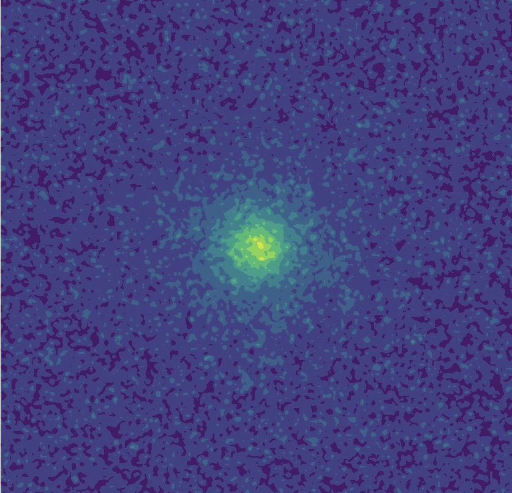
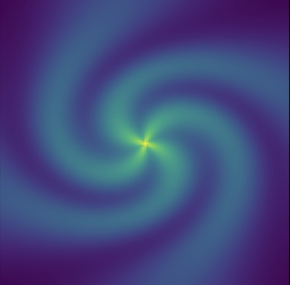
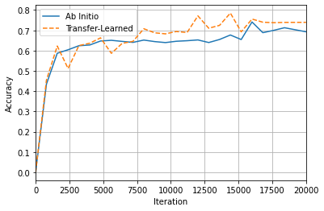

# Summary 
The astronomy community is experiencing a lack of benchmark datasets tailored towards machine learning and computer vision problems. 
The overall goal of this software is to fill this need. 
We introduce the python library *DeepBench*, which is designed to 
provide a method of producing highly reproducible  datasets at varying levels of complexity, size, and content. 
The software includes simulation of basic geometric shapes and astronomical structures, 
such as stars and elliptical galaxies, as well as tools to 
collect and store the dataset for consumption by a machine learning algorithm. 
We also present a trained ResNet-50 model as an illustration of the expected use of the software as a 
benchmarking tool for different architectures’ suitability to scientifically motivated problems. 
We envision this tool to be useful in a suite of contexts at the intersection of astronomy and machine learning. 
For example, this could be useful for those new to machine learning principles and software, 
as a way to build their skills and tools with a toy-model data set that looks like astronomical data. 
Also, experts can use this tool to build simple data sets that allow them to check their models. 
Finally, the geometric/polygon images can be used as a highly simplified version of astronomical objects: 
this could be used for addressing a spectrum of problems from object classification to deblending.

# Statement of Need 

*DeepBench* was designed to fill two clear needs.  
It can be used to produce computer vision data sets with varying levels of complexity to help the diagnose
machine learning model errors -- for users of any level of experience in machine learning.
It is also intended as a generator of benchmark data sets. 

The software is intended for use as a diagnosis tool to help users identify model weaknesses and assess issues during 
machine learning model training.*DeepBench* makes it easy to incrementally increase and decrease the data object 
complexity (e.g., remove noise, decrease the number of classes, increase the class balance), which is helpful when 
seeking weak points in a machine learning model architecture or training schedule.

More explicitly, in the case of a task like gravitational lensing classification, it would be possible to move from a 
dataset containing real images, to a simulated dataset containing a similar distribution of objects as the training set,
and incrementally remove elements such as noise from simulated images. 

The astronomy community is long familiar with short-term data challenges that use benchmark data sets -- e.g. the G
REAT challenges for weak gravitational lensing [@Bridle_2009], the finding challenges for strong lensing [@Metcalf_2019], 
and the supernova classification PLASTICC challenge [@https://doi.org/10.48550/arxiv.2012.12392]. 
However, there do not yet exist benchmark data sets that permit persistent, long-term model comparisons and testings 
that are particularly relevant for astronomy and physics. 

Most persistent benchmark datasets for computer vision -- e.g., MNIST [@deng2012mnist], CIFAR [@cifar10] -- are not 
designed with the intent of developing models for astronomy research, as their focus tends to be replicating human 
vision and identification techniques. 
This leads to 1) a lack of accuracy baselines for networks that are applicable for astronomy problems, and 2) a lack 
of pre-trained weights for large architectures that can be used in transfer and semi-supervised learning problems. 

*DeepBench* aims to help fill this need by providing the capability to generate simulated datasets that contain 
distributions of objects that more closely match the type of datasets used in more realistic studies: studies relying 
on pre-built architectures need not retrain all weights from scratch. 
Training techniques that use transfer learning often have drastically decreased training run times, as well as provide 
out-of-the-box weights that can perform on related astronomy problems. 

# State of the Field
Benchmarking and dataset generation is heavily used in the field of Machine Learning. 
Works that are most closely related to the work described here include *SHAPES* [@DBLP:journals/corr/WuTWSDH16] for its 
use of collections of geometric objects as a benchmark with varying levels of complexity,
and  *deeplenstronomy* [@deeplenstronomy] for its packaging of the strong lensing framework 
*lenstronomy* [@Bridle_2009] into tools with ease of use and reproducibility included in their design.

# Methods 
The library is broken into 3 main modules- image; for composing the finished images with noise and multiple objects, 
object; for make each shape or astronomical structure that will be in an image, cataloge and collection; for creating groups 
of images with their associated metadata. 

![{The *DeepBench* workflow. 
Dataset parameters (type of objects in each image, qualities of each object), are passed by the Catalogue module (1) by the user. 
These are used the Image module (2) to call and construct each Object (3) that will be included in the final image.
This module also combines called objects into one image, and "image level" noise is applied, choosing from either Gaussian or Poisson distributions. 
The parameters of each object within the image are saved by Catalogue (1), along with the image itself.\label{fig:diagram}](paper_images/bench_diagram.png){width=40%}

## Images 
The image module allows users to concatenate various shape or astronomical objects within a *matplotlib* [@Hunter:2007] 
meshgrid object in order to simulate the profiles and shape distributions commonly seen in images 
used in more complex astronomical data sets. 

Three distinct image types are available - sky images (\autoref{fig:spiral}, \autoref{fig:spiral_arms}, 
\autoref{fig:star}, \autoref{fig:ellipse}), 
lensing images (\autoref{fig:lens}), and geometric images (\autoref{fig:geo}). 
Sky images are composed of any combination of user-specified galaxy and star objects, while lensing images are 
randomized combinations of arc and star objects. 
Lastly, geometric images are canvased assortments of any of the individual geometric shape objects available.

### Examples

## Objects 

### Geometric Objects

Geometric objects are all generated by using the *matplotlib* library and are able to either be left as solid two-dimensional 
shapes or of an outline with a varying thickness. 
Shapes include rectangles, $n$-sided regular polygons, arcs, straight lines, ellipses, and circles. 
Shapes are limited to two-color rendering, such that all shapes are composed of 0 and 1 values within an array. 
They can be combined in multiple ways using the "Image" module to produce composite images with both different 
geometric objects and astronomical objects. 

### Astronomical Objects

Astronomical objects offer simplified renderings of common profiles found in astronomical data sets. 
These objects can be either 1D or 2D models, depending on the object type. 
They can also have parameters that are either randomized or manually specified by the user via a configuration file.

#### One-Dimensional Models

The **N-Body** object is currently the sole one-dimensional model available in the alpha release. 
The N-Body model is output as a set of *NumPy* [@harris2020array] arrays containing coordinates representing the path 
of the points produced, along with the kinetic and potential energy produced over the specified duration.

#### Two-Dimensional Models

Two-dimensional models are representations of astronomical objects commonly found in data sets used for galaxy morphology classification. 
All objects also come with the option to append various levels of Gaussian and Poisson noise, and are output as *NumPy* arrays. 
The following are the objects currently available via alpha release.

###### Star
The **Star** object is created using the Moffat distribution provided by the *AstroPy* [@astropy:2018] modeling library. 

###### Elliptical Galaxy
The *Elliptical Galaxy* object is created using the Sérsic profile provided by the *AstroPy* modelling library. 

###### Spiral Galaxy
The profile of the **Spiral Galaxy** object is created by simulating the function used to produce a logarithmic spiral
[@Ringermacher_2009], along with reproducing the following relationship:

\begin{equation}
    r(\phi) = A / log[B*tan(\phi/2N)]
\end{equation}

Where $A$ defines the scale of the galaxy, $B$ controls spiral pitch, $N$ is the 'winding number', with defines the 
tightness of the arms, and $\phi$ is the angle of parallelism. 

## Cataloge and Collection 
The Catalogue module allows users to specify the size, contents, and output directory of a data set composed of 
*DeepBench*'s available image types or individual object images. 

Catalogues can either be entirely randomized, with parameters of the included image being randomly chosen, 
or have parameters specified by the user at various levels of granularity. 

The only required argument in the creation of Catalogue objects are the output directory and image type. 
Within the Catalogue module also exists a Collection class, which concatenates various catalogues of varying
image types into one data set. 

Catalogues and collections can be output in the formats .jpeg, .npy, or .h5.

# Executed Benchmark
n the interest of providing executed benchmarks, multiple  ResNet-50 models [@DBLP:journals/corr/HeZRS15] were trained
for five different classification tasks.
The  ResNet-50 architecture was selected for both its high performance for image classification tasks, 
overall popularity, and existing benchmark runs on many other computer vision datasets. 

The architectures were trained using the *pyTorch* framework [@NEURIPS2019_9015], using three different *DeepBench* 
variants: (1) a dataset containing "Sky" images, containing multiple structures per image; (2) a dataset containing 
geometric shapes, with multiple shapes per image; (3) individual astronomical structures, with one star, galaxy, 
or spiral galaxy per image.
Each dataset contained 10,000 total images, split 60/20/20 between training, validation, and testing distributions, 
respectively. 

All models were trained with a batch size of 64, learning rate of 0.524, and weight decay rate of 0.00125. 

\caption{Summary of results for the benchmark trained ResNet models. }
\label{tab:accuracies}

|  Dataset          | Accuracy|
|-------------------|---|
 | Sky Images        | 95.7|
 | Geometric Images  | 97.3|
| Astronomy Objects |  97.1|

For the transfer learning trial, a ResNet-50 model without prior weights was trained on the dataset of randomly produced
sky images used in the previous classification task, while another model was produced without any defined weights. 
The comparison dataset used for the transfer learning was composed of a collection of 5000 images from the GalaxyZoo2 
[@Willett_2013] dataset. 
The included class labels were cigar-shaped smooth, ring-shaped, merging, and spiral, with each class having 
approximately equal representation. 
All layers of the model trained on the DeepBench dataset, with the exception of the input and output layers,
were then transferred to a separate model used to classify the GalaxyZoo2 images. 
The model without pre-defined weights was solely trained on GalaxyZoo2 images. 

The transfer-learned model was able to reach the accuracy achieved by the non-transfer learning model after 
approximately 10,000 iterations, as seen in Figure \autoref{fig:transfer}. 

Table 2 presents the accuracies of each approach after 16,000 iterations. 
Although training did not reach convergence, the significant difference in produced accuracy becomes clear early on.

|Approach | Accuracy |
|---|------|
|Transfer-Learned Model | 73.1 |
|Ab Initio Model  | 69.3 |

# Conclusion and Outlook 
*DeepBench* fulfills the demand for simple, seamlessly-integrated benchmark datasets for common astronomy-focused machine
learning tasks. 
Due to its focus, it lends itself towards being a base for transfer-learning problems in so that higher accuracies can 
be reached in shorter training times.
We envision pre-trained models based on *DeepBench* being used across a wide range of experiments and projects.
We hope that using this method of benchmarking allows for easier communication and comparison of results, and encouraging 
collaboration between different research projects working on similar problems.

By designing a system that is simultaneously configurable yet undemanding, *DeepBench*'s straight-forward command-line 
tool allows users to quickly produce benchmarks personalized to fit their particular testing needs. 
Interfaces are provided for objects that range in complexity from simple geometric shapes to more complex simulations of 
common astronomical profiles, with no defined limit to the amount of data that can be produced. 
The straightforward nature also encourages new practitioners, with simple cases for classification and regression available.

With the beta release of *DeepBench*, more attention will be paid to expanding the number of objects available in the one- 
and three-dimensional modelling modules.

# Acknowledgements 
We acknowledge the Deep Skies Lab as a community of multi-domain experts and collaborators who’ve facilitated an environment 
of open discussion, idea-generation, and collaboration. 
This community was important for the development of this project.

This manuscript has been authored by Fermi Research Alliance, LLC under Contract No. DE-AC02-07CH11359 with the U.S. 
Department of Energy, Office of Science, Office of High Energy Physics.

# Citations 

